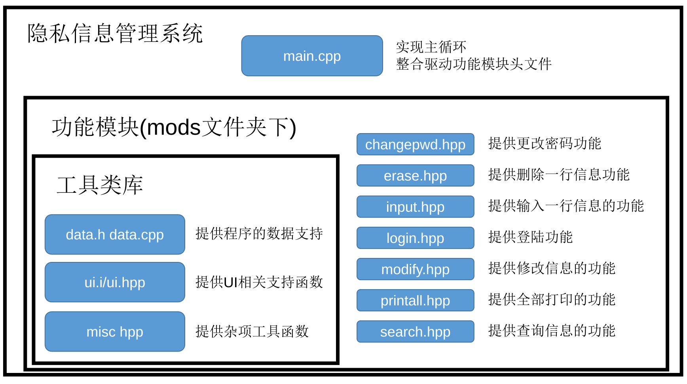

# 阅读须知

本次课设报告任务一的代码前均引入了 `ATL/base/include/cardinal.hpp`头文件，为避免重复在这里一次性给出。

任务二和任务三将使用 `xmake`构建工具，使用 `C++20`标准编译。

本人使用 `C++11 `高级模板技巧原创 `ATL`通用算法模板库github开源地址：https://github.com/OrbitZore/ATL

```cpp
#include <bits/stdc++.h>
using namespace std;
struct FAST_IO{
	FAST_IO(){
		ios_base::sync_with_stdio(false);
		cin.tie(NULL);
	}
}__fast_io;
#if __cplusplus < 201402L
template<class T, class U=T>
T exchange(T& obj, U&& new_value){
    T old_value=move(obj);
    obj=forward<U>(new_value);
    return old_value;
}
#endif
#define cons(a,...) a=typename decay<decltype(a)>::type(__VA_ARGS__)
using INT=int;
#define x first
#define y second
//#define int long long
#define pb push_back
#define eb emplace_back
#define all(a) (a).begin(),(a).end()
auto &_=std::ignore;
using ll=long long;
template<class T>
using vec=vector<T>;
template<bool B,class T=void>
using enableif_t=typename enable_if<B,T>::type;

#define DEF_COULD(name,exp) \
template<class U> \
struct name{\
	template<class T>\
	constexpr static auto is(int i)->decltype(exp,true){return true;}\
	template<class T>\
	constexpr static bool is(...){return false;}\
	static const bool value=is<U>(1);\
};
#define DEF_CAN(name,exp) DEF_COULD(can##name,exp)
#define ENABLE(T,name) enableif_t<can##name<T>::value>(1)
#define ENABLEN(T,name) enableif_t<!can##name<T>::value>(1)
#define FOR_TUPLE enableif_t<i!=tuple_size<T>::value>(1)
#define END_TUPLE enableif_t<i==tuple_size<T>::value>(1)
#define FOR_TUPLET(T) enableif_t<i!=tuple_size<T>::value>(1)
#define END_TUPLET(T) enableif_t<i==tuple_size<T>::value>(1)

#define DEF_INF(name,exp)\
constexpr struct{\
	template<class T>\
	constexpr operator T()const {return numeric_limits<T>::exp();}\
} name;

DEF_CAN(Out,(cout<<*(T*)(0))) DEF_CAN(For,begin(*(T*)(0)))
DEF_INF(INF,max) DEF_INF(MINF,min)

template<size_t i,class T>
auto operator>>(istream& is,T &r)->decltype(END_TUPLE,is){
	return is;
}
template<size_t i=0,class T>
auto operator>>(istream& is,T &r)->decltype(FOR_TUPLE,is){
	is>>get<i>(r);
	return operator>> <i+1>(is,r);
}

template<size_t i,class ...Args>
auto operator>>(istream& is,const tuple<Args&...> &r)->decltype(END_TUPLET(tuple<Args&...>),is){
	return is;
}
template<size_t i=0,class ...Args>
auto operator>>(istream& is,const tuple<Args&...> &r)->decltype(FOR_TUPLET(tuple<Args&...>),is){
	is>>get<i>(r);
	return operator>> <i+1>(is,r);
}

template<class T>
auto __format(ostream &os,const char *c,const T& cv)->decltype(ENABLE(T,Out),c+1);
template<size_t i,class T>
auto __format(ostream &os,const char *c,const T& cv)->decltype(ENABLEN(T,For),END_TUPLE,c+1);
template<size_t i=0,class T>
auto __format(ostream &os,const char *c,const T& cv)->decltype(ENABLEN(T,For),FOR_TUPLE,c+1);
template<class T>
auto __format(ostream &os,const char *c,const T& cv)->decltype(ENABLEN(T,Out),ENABLE(T,For),c+1);


template<class T>
auto __format(ostream &os,const char *c,const T& cv)->decltype(ENABLE(T,Out),c+1){
	os << cv;
	while (*c!='}') c++;
	return c+1;
}
template<size_t i,class T>
auto __format(ostream &os,const char *c,const T& cv)->decltype(ENABLEN(T,For),END_TUPLE,c+1){
	return c;
}
template<size_t i,class T>
auto __format(ostream &os,const char *c,const T& cv)->decltype(ENABLEN(T,For),FOR_TUPLE,c+1){
	while (*c!='{') os << *c++;
	c=__format(os,c,get<i>(cv));
	return __format<i+1>(os,c,cv);
}
template<class T>
auto __format(ostream &os,const char *c,const T& cv)->decltype(ENABLEN(T,Out),ENABLE(T,For),c+1){
	const char *ct=c+1;
	if (cv.size()==0){
		while (*ct!='}') ct++;
		ct++;
		while (*ct!='}') ct++;
	}else{
		for (auto &i:cv){
			const char *cc=c+1;
			while (*cc!='{') os << *cc++;
			cc=__format(os,cc,i);
			while (*cc!='}') os << *cc++;
			ct=cc;
		}
	}
	return ct+1;
}
void _format(ostream &os,const char *c){
	while (*c!='{'&&*c!='\0') os<< *c++;
}
template<class T,class ...Args>
void _format(ostream &os,const char *c,const T &a,const Args& ...rest){
	while (*c!='{'&&*c!='\0') os<< *c++;
	if (*c=='{') c=__format(os,c,a);
	_format(os,c,rest...);
}
template<class ...Args>
string format(const char *c,const Args& ...rest){
	ostringstream os;
	_format(os,c,rest...);
	return os.str();
}
template<class ...Args>
ostream& print(const char *c,const Args& ...rest){return _format(cout,c,rest...),cout;}
template<class ...Args>
ostream& println(const char *c,const Args& ...rest){return print(c,rest...)<<endl;}

#ifndef LOCAL
#define debug(...) cerr<<format(__VA_ARGS__)
#else
#define debug(...) cerr
#endif
template<class T,class ...Args>
struct Rtar{
	T& a;tuple<Args...> n;
	Rtar(T& a,tuple<Args...> n):a(a),n(n){}
};
template<class T,class ...Args>
Rtar<T,Args&...> rtar(T &a,Args&... rest){
	return Rtar<T,Args&...>(a,tie(rest...));
}
template<size_t i,class U,class ...Args,class T=tuple<Args&...>>
auto operator>>(istream& is,Rtar<U,Args&...> r)->decltype(END_TUPLE,is){
	return is>>r.a;
}
template<size_t i=0,class U,class ...Args,class T=tuple<Args&...>>
auto operator>>(istream& is,Rtar<U,Args&...> r)->decltype(FOR_TUPLE,is){
	r.a=typename decay<U>::type(get<i>(r.n));
	for (auto &w:r.a)
		operator>> <i+1>(is,Rtar<decltype(w),Args&...>(w,r.n));
	return is;
}
template<class T1,class T2>
bool cmin(T1 &a,const T2 b){return a>b?a=b,1:0;}
template<class T1,class T2>
bool cmax(T1 &a,const T2 b){return a<b?a=b,1:0;}
template<class T1,class T2,class ...T3>
bool cmin(T1 &a,const T2 b,const T3 ...rest){return cmin(a,b)|cmin(a,rest...);}
template<class T1,class T2,class ...T3>
bool cmax(T1 &a,const T2 b,const T3 ...rest){return cmax(a,b)|cmax(a,rest...);}
bool MULTIDATA=true;
```


# 任务一
## 个位求和【增强版】

将一个整数区间内所有整数的个位相加并输出。

$[m,n](m<=n)$

### 思路

1. 不妨设$m\ge0$
设$f(a)$为$[1,a]$中所有整数的个位数和，答案即为$f(n)-f(m-1)$。
观察到$f(a+10)=f(a)+\sum_{i=0}^9i=f(a)+45$，可知$f(a)=f(a\%10)+45\cdot\lfloor a/10\rfloor$
预处理出$f(a),a\in[0,9]$即可。
2. 考虑$m<0$
    1. $n<0$
      等价于$n=-n,m=-m$的情况。
    2. $n>0$
      等于$f(n)+f(-m)$。

### 代码

```cpp
constexpr int dsum(int b,int c,int n){
    return (2*b+c*(n-1))*n/2;
}
 
constexpr int ssum(int b,int e,int n){
    return (b+e)*n/2;
}
 
ll f(int i){
    i=abs(i);
    return i/10*ssum(0,9,10)+dsum(0,1,i%10+1);
}
 
int main(){
    ll n,m;
    cin>>n>>m;
    if (n>0&&m>0||n<0&&m<0){
        tie(n,m)=minmax({abs(n),abs(m)});
        n--;
        cout<<(f(m)-f(n))<<endl;
    }else cout << f(n)+f(m);
}
```


## 找顺数（加强版）

现在给出一个大于1的正整数n，请你求出在1到n的正整数中，至少有一个数位含有6的正整数个数。

### 思路

设$n$有$nb$位。

定义$f(a)$为$a$位数的个数。

$g(a)$为$nb$位数的后$a-1$位中至少有一个数位含有6，而且第$nb$位到$a$位和$n$相等的整数个数。

递归处理即可。

### 代码

```cpp
int c[100];
int cn[100];
int p10[10];
int F[10];
int f(int i){
    if (F[i]!=-1) return F[i];
    if (i==1) return F[i]=1;
    return F[i]=p10[i-1]+9*f(i-1);
}
int g(int n){
    int cc=c[n-1];
    if (n==1)
        return cc>=6?1:0;
    if (cc==6) 
        return cc*f(n-1)+cn[n-2]+1;
    if (cc>6)
        return (cc-1)*f(n-1)+p10[n-1]+g(n-1);
    return cc?cc*f(n-1)+g(n-1):g(n-1);
}
int main(){
    memset(F,-1,sizeof(F));
    p10[0]=1;for (int i=1;i<10;i++) p10[i]=10*p10[i-1];  
    int n=0;
    while (isdigit(c[n]=cin.get())) c[n++]-='0';
    c[n]=0;
    for (int i=0;i<n/2;i++) swap(c[i],c[n-1-i]);
    cn[0]=c[0];
    for (int i=1;i<n;i++)
        cn[i]=c[i]+cn[i-1]*10;
    cout << g(n) << endl;
}
```


## 求对称数

如果给定一个对称数n，请你求出大于n的最小对称数(即这个数从左向右读和从右向左读是完全一样的)。

$n\le 10^9$

### 思路

考察全体小于$10^9$对称数集合$A$的大小，发现对于位数$m$为偶数的对称数可以建立其与全体位数为$\frac m 2$的自然数的双射。对于位数$m$为奇数的对称数可以建立其与全体位数为$\lceil\frac m 2\rceil$的自然数的双射。

所以$A$的大小在$10^5$左右，尝试生成$A$，二分解决。

### 代码

```cpp
vec<int> s;
int p10[10];
void f(int n,int i=0,int w=0){
    if (i>(n-1)/2){
        for (;i!=n;i++){
            w+=p10[i]*(w/p10[n-1-i]%10);
        }
        s.push_back(w);
        return ;
    }
    for (int j=i==0?1:0;j<10;j++)
        f(n,i+1,w+p10[i]*j);
}
int main(){
    p10[0]=1;for (int i=1;i<10;i++) p10[i]=10*p10[i-1];  
    for (int i=1;i<10;i++){
        f(i);
    }
    f(10,1,1);
    sort(all(s));
    int T;cin>>T;
    while (T--){
        int n;cin>>n;
        cout<<*upper_bound(all(s),n)<<endl;
    }
}
```


## 通讯录排序

输入n个朋友的信息，包括姓名、生日、电话号码，本题要求编写程序，按照年龄从大到小的顺序依次输出通讯录。题目保证所有人的生日均不相同。

### 思路

使用ATL处理读入，传比较年龄lambda给`std::sort`。注意年龄使用字符串存，数字存需要处理前导零。

### 代码

```cpp
int main(){
    int n;
    using T=tuple<string,array<char,8>,string>;
    vec<T> v;
    cin>>n>>rtar(v,n);
    sort(all(v),[](const T& x,const T& y){
        return get<1>(x)<get<1>(y);
    });
    print("{{} {{}} {}\n}",v);
}
```


## 主元素


$n\le 100000$

求主元素，如果没有主元素则输出$-1$。

### 思路

- 假设有主元素。

考虑随机选中序列$A$中的一个元素，有大于一半的概率选中主元素。那么任取两元素$a,b$，只要一个不是主元素，删掉后序列的主元素不变。

- 没有主元素

使用有主元素的方法求出，然后再遍历一遍$A$判断出现次数即可。

### 代码

```cpp
int main(){
    int n;
    vec<int> v;
    while (cin>>n>>rtar(v,n)){
        int w=-1,wc=0;
        for (auto i:v)
            if (i!=w){
                if (wc) wc--;
                else {w=i;wc=1;}
            }else wc++;
        int c=0;
        for (auto i:v) if (w==i) c++;
        if (c>n/2) cout << w << endl;
        else cout << -1 << endl;
        v.clear();
    }
}
```


# 任务2-隐私信息管理系统

## 需求分析

用户需要一个软件保存网站上保存的用户名和密码。需要保存的记录如下表所示。

| 编号 | 帐号位置                   | 帐号描述     | 帐号名          | 密码   |
| ---- | -------------------------- | ------------ | --------------- | ------ |
| 1    | https://next.xuetangx.com  | 学堂在线     | xiangdesheng    | 123456 |
| 2    | http://acm.hdu.edu.cn      | 杭电OJ       | acm002          | 654321 |
| 3    | https://www.icourse163.org | 中国大学MOOC | 30047495@qq.com | 123456 |

## 设计目标

系统具体提供以下功能：

- 系统以菜单方式工作。开始运行程序时要进行密码验证。
- 信息的录入功能、浏览功能。
- 信息的查询功能。按帐号名查询，如输入“acm”可查出上表第2条记录。
- 信息的删除、修改功能。
- 信息存入文件。信息中的密码必须要加密后才能存入文件。

除此以外，因选定的编译环境支持多操作系统，所以本项目亦需要支持 `windows`和 `linux`操作系统。

## 总体设计

### 编译环境

本次实验将使用头文件和单头文件技术。使用 `xmake`编译工具，`C++20`标准编译项目。

### 文件模块介绍



## 详细设计

### src/main.cpp

```cpp
#include "cardinal.hpp"
#include "ui.h"
#include "data.h"
#include "mods/allmods.hpp"

const vec<string> main_menu={
    "输入信息",
    "查询信息",
    "查看全部信息",
    "修改信息",
    "删除信息",
    "更改密码",
    "退 出"
};
void(*menu_func[])(void)={
    input,
    search,
    printall,
    modify,
    erase,
    changepwd,
    [](){exit(0);}
};
int main(int argc, char** argv){
    inidb1();//data.h提供，初始化密码
    login();//mod/login.hpp提供
    inidb2();//data.h提供，
    while (true){//主循环
        int w=ui::choose(main_menu,"主菜单");
        menu_func[w]();
        syncdb();
        ui::getline("按回车键返回主菜单",true);
    }
    return 0;
}
```

### data.h/data.cpp简要介绍

- data.h

```cpp
string encrypt(const string& a,const string& key="");//加密
string decrypt(const string& a,const string& key="");//解密
string shash(const string& a);//哈希

string encode(const string& a);//编码（去除换行符）
string decode(const string& a);//解码

inline const map<string,string> default_kv={//默认密码
    {"password",shash("passwd")},
};
struct user{//一行信息
    string pos,description,name,pwd;
    string to_string() const;//序列化
    static user from_string(string str);//反序列化
};
using dbT=map<string,string>;//键值数据库基于std::map
extern dbT data_base;//键值数据库
extern vec<user> user_list;//用户信息列表
void syncdb();//写入数据库到文件

void inidb1();//初始化密码
void inidb2();//登陆成功后获取数据库
```

- data.cpp

加密/解密函数实现使用了模意义上的乘法逆元，加密步骤循环对原串每一位在模数为$65521$的同余系上乘上$a$，以两个字节输出。$a$每次和 `key`迭代加盐哈希。解密则反之。能实现较强的加密，但是会占用两倍的存储空间。

```cpp
string encrypt(const string& a,const string& key){
    using mchar=_mint<uint16_t,uint32_t,65521>;
    auto num=hash<string>()(key);
    string w;
    for (auto i:a){
        mchar c=(uint16_t)(unsigned char)i;
        c*=(mchar)num;
        w+=c.v&(0x00ff);
        w+=(c.v&(0xff00))>>8;
        num=hash<string>()(to_string(num)+"salt"+key);
    }
    return w;
}

string decrypt(const string& a,const string& key){
    using mchar=_mint<uint16_t,uint32_t,65521>;
    auto num=hash<string>()(key);
    string w;
    for (size_t i=0;i<a.size();i+=2){
        mchar c=(uint16_t)(unsigned char)a[i]|
        ((uint16_t)(unsigned char)a[i+1]<<8);
        c/=(mchar)num;
        w+=(char)c.v;
        num=hash<string>()(to_string(num)+"salt"+key);
    }
    return w;
}
```

为了方便哈希直接使用了 `std::hash`。

```cpp
string shash(const string& a){return to_string(hash<string>()(a));}
```

`encode`和 `decode`函数用于转义和反转义。转义的目的是为了去掉回车符。而 `decodep`使用转义后没有单个'\\'字符的特性，将输入字符串根据单个'\\n'字符分割输入字符串。可以用于用户信息序列化字符串的分割和多用户信息的分割。

```cpp
string encode(const string& a){//del \n
    string r;
    for (auto &i:a){
        if (i=='\\'){
            r+="\\\\";
        }else if (i=='\n'){
            r+="\\n";
        }else r+=i;
    }
    return r;
}

string decode(const string& a){//gen \n
    string r;
    for (size_t i=0;i<a.size();i++){
        auto ai=a[i];
        if (ai=='\\'){
            if (i+1<a.size()){
                if (a[i+1]=='n'){
                    i++;
                    r+='\n';
                }else if (a[i+1]=='\\'){
                    i++;
                    r+='\\';
                }
            }
        }else r+=ai;
    }
    return r;
}

vec<string> decodep(const string& a){//gen \n
    vec<string> r;string w;
    for (size_t i=0;i<a.size();i++){
        auto ai=a[i];
        if (ai=='\\'){
            if (i+1<a.size()){
                if (a[i+1]=='n'){
                    i++;
                    w+='\n';
                }else if (a[i+1]=='\\'){
                    i++;
                    w+='\\';
                }else{
                    if (w.size()){
                        r.push_back(move(w));
                        w=string();
                    }
                }
            }
        }else w+=ai;
    }
    if (w.size()) r.push_back(move(w));
    return r;
}
```

单个用户数据的序列化和反序列化，和全部用户数据的序列化和反序列化。

```cpp
#define config_filename (config_dir+"pwdkeeper.cfg")

string user::to_string()const{
    return
    encode(pos)+"\\"+
    encode(description)+"\\"+
    encode(name)+"\\"+
    encode(pwd);
}

user user::from_string(string str){
    user u;
    auto v=decodep(str);
    u.pos=move(v.at(0));
    u.description=move(v.at(1));
    u.name=move(v.at(2));
    u.pwd=move(v.at(3));
    return u;
}

string encode_users(const vec<user>& v){
    string str;
    for (size_t i=0;i<v.size();i++)
        str+=encode(v[i].to_string())+"\\";
    return str;
}

vec<user> decode_users(const string& str){
    vec<user> v;
    auto w=decodep(str);
    for (auto& i:w)
        v.push_back(user::from_string(i));
    return v;
}
```

数据库存入文件时将用户信息列表存入数据库，然后将数据库序列化后加密输出。

```cpp
void syncdb(){
    ofstream os(config_filename,ios::binary);
    string out;
    data_base["users"]=encode_users(user_list);
    for (auto &[k,v]:data_base){
        out+=encode(k)+"="+encode(v)+"\n";
    }
    os<<data_base["password"]<<endl<<
    encrypt(out,decrypt_key);
}
```

数据库的读入分两个步骤，第一步调用 `inidb1`获取到密码的哈希值。之后 `login`模块会根据密码的哈希值计算得到数据库加密密钥 `decrypt_key`。第二步调用 `inidb2`根据 `decrypt_key`解密数据库。

```cpp
void inidb1(){
    data_base=default_kv;
    ifstream is(config_filename,ios::binary);
    string a;
    getline(is,a);
    if (a.size()){
        data_base["password"]=a;
    }else return ;
}
void inidb2(){
    string input;
    {
        ifstream is(config_filename,ios::binary);
        while (is&&is.get()!='\n');
        while (is) input+=is.get();
    }
    auto w=split(decrypt(input,decrypt_key),"\n");
    for (auto& str:w){
        int w=str.find('=');
        if (str.size()&&(0<=w&&w<str.size()))
            data_base[decode(str.substr(0,w))]=decode(str.substr(w+1));
    }
    user_list=decode_users(data_base["users"]);
}

```

### ui.h

所有ui被包含在ui命名空间下，基于UI和数据操作可以分离的思想（即前后端分离）。

```cpp
#pragma once

#include "cardinal.hpp"
namespace ui{

string getline(const string& msg,bool allow_empty=false);//根据提示请求用户输入一行字符串

istream& getline(string &str,const string& msg,bool allow_empty=false);//上一个函数的引用版本

int choose(const vec<string>& v,const string& name="");//在菜单中选择一项

size_t getint(size_t l,size_t r,const string& msg="");//输入[l,r)中的一个整数
}

```

### os.hpp

根据操作系统的不同使用不同路径保存数据库。

```cpp
#ifdef _WIN32
inline const string config_dir=string(getenv("appdata"))+"\\";
#else
inline const string config_dir=string(getenv("HOME"))+"/.config/";
#endif
```

### mods文件夹下功能模块

#### changepwd.hpp

更改密码，为了安全写入到数据库的是密码的哈希值。

```cpp
inline void changepwd(){
    string pwdnew=ui::getline("请输入新密码:"s);
    data_base["password"]=shash(pwdnew);
    update_decrypt_key(pwdnew);
    println("更改密码成功");
}
```

#### earse.hpp

删除一行信息。

```cpp
inline void erase(){
    size_t wi=ui::getint(0,user_list.size(),"请输入将删除的编号");
    auto& u=user_list[wi];
    println("选中) {} {} {} {} {} {}",wi,u.pos,u.description,u.name,u.pwd);
    string str=ui::getline("输入yes（小写）删除");
    if (str=="yes"){
        user_list.erase(user_list.begin()+wi);
        println("删除完毕");
    }else{
        println("用户取消删除");
    }
    syncdb();
}
```

#### input.hpp

添加一个新用户。

```cpp
inline void input(){
    user_list.push_back(user{
        ui::getline("请输入新用户帐号位置"),
        ui::getline("请输入新用户帐号描述"),
        ui::getline("请输入新用户帐号名"),
        ui::getline("请输入新用户密码")
    });
    syncdb();
}
```

#### login.hpp

登陆模块。

```cpp
inline string decrypt_key;
inline void update_decrypt_key(const string& rawpwd){
    decrypt_key=shash(rawpwd+"salt"+shash(rawpwd));//加盐
}
inline void login(){
    while ([](){
        string password;
        ui::getline(password,"请输入密码:"s);
        if (data_base["password"]==shash(password)){
                println("登陆成功");
                update_decrypt_key(password);
                return false;
            }
        println("用户名或密码错误，登陆失败");
        return true;
    }());
}
```

#### modify.hpp

修改一个用户信息的模块。

```cpp
inline void modify(){
    size_t wi=ui::getint(0,user_list.size(),"请输入将修改的编号");
    auto& u=user_list[wi];
    println("选中) {} {} {} {} {} {}",wi,u.pos,u.description,u.name,u.pwd);
    size_t ci=ui::choose({
        "帐号位置","帐号描述","帐号名","密码"
    },"请选中将要修改的值");
    if (ci==0){
        u.pos=ui::getline("请输入新的帐号位置");
    }else if (ci==1){
        u.description=ui::getline("请输入新的帐号描述");
    }else if (ci==2){
        u.name=ui::getline("请输入新的帐号名");
    }else if (ci==3){
        u.pwd=ui::getline("请输入新的密码");
    }
    println("修改完毕，结果为\n) {} {} {} {} {} {}",wi,u.pos,u.description,u.name,u.pwd);
    syncdb();
}
```

#### printall.hpp

输出全部用户信息的模块

```cpp
inline void printall(){
    println("共 {} 条信息",user_list.size());
    println("( {} {} {} {} {}","编号","帐号位置","帐号描述","帐号名","密码");
    for (size_t i=0;i<user_list.size();i++){
        auto& u=user_list[i];
        println("( {} {} {} {} {}",i,u.pos,u.description,u.name,u.pwd);
    }
}
```

#### search.hpp

查询用户信息的模块

```cpp
inline void search(){
    string str=ui::getline("请输入帐号位置");
    vec<pair<int,reference_wrapper<user>>> v;
    for (size_t i=0;i<user_list.size();i++){
        auto &ui=user_list[i];
        if (ui.pos.find(str)!=string::npos)
            v.push_back({i,ref(ui)});
    }
    println("查询 {} ,总共 {} 条信息",str,v.size());
    println(") {} {} {} {} {}","编号","帐号位置","帐号描述","帐号名","密码");
    for (size_t i=0;i<v.size();i++){
        int ii=v[i].first;
        user& u=v[i].second.get();
        println(") {} {} {} {} {} {}",ii,u.pos,u.description,u.name,u.pwd);
    }
}
```

## 遇到的问题和解决办法

根据ODR（One Definition Rule，单一定义原则）。在一个cpp文件中只允许有一个定义，头文件中只能包含声明。而对于单一头文件即既包含声明和实现的hpp文件，需要加入inline指定不同翻译单元(cpp文件)间合并相同的定义。

## 结束语

学习到了现代C++工程构建技术，和玩具级加密解密技术。


# 任务三-电子印章制作程序

## 需求分析

用户需要制作一个软件输入四字生成以下形状的电子印章。


## 设计目标

程序具体要实现以下功能

- 读取字库
- bmp文件格式的写入

## 总体设计

### 编译环境

本次实验将使用头文件和单头文件技术。使用 `xmake`编译工具，使用来自`GNU project`的`libiconv`项目转码`UTF-8`输入，`C++20`标准编译项目。

### 文件模块介绍


## 详细设计

### bmp.hpp

提供BMP文件头信息结构体，一并给出第一步生成头文件信息结构体的函数。

```cpp
namespace bmp{
    using i32=int32_t;//LONG
    using u32=uint32_t;//DWORD
    using i16=int16_t;//
    using u16=uint16_t;//WORD
    #pragma pack(push,1)
    //取消内存对齐，直接可以dump到文件
    struct BMP_HEADER{
        u16 bfType{0x4D42};
        u32 bfSize;//
        u16 bfReserved1{0};
        u16 bfReserved2{0};
        u32 bfOffBits;
    };
    struct BMP_INFO_HEADER{
        u32 biSize{40};
        i32 biWidth;
        i32 biHeight;
        u16 biPlanes{1};
        u16 biBitCount;
        u32 biCompression{0};
        u32 biSizeImage;
        i32 biXPelsPerMeter{11811},biYPelsPerMeter{11811};
        u32 biClrUsed;//
        u32 biClrImportant{0};
    };
    struct BMP_FILE_HEADER{
        BMP_HEADER h1;
        BMP_INFO_HEADER h2;
    };
    #pragma pack(pop)
    inline BMP_FILE_HEADER make_rgb_header(i32 n,i32 m){
        BMP_FILE_HEADER a;
        tie(a.h2.biHeight,a.h2.biWidth)=make_tuple(n,m);
        a.h1.bfOffBits=sizeof(a.h1)+sizeof(a.h2);
        return a;
    }

}
```

### image.hpp

提供抽象图像信息模板类原型`_bitmap<T>`，并特化为`bitmap`和`rgbmap`。其中`bitmap`将在读取字库的`fonts.hpp`中用到，`rgbmap`则为最终输出BMP文件用到。然后实现`rgbmap`的转`bmp`文件字符串函数。

```cpp
using rgb=array<uint8_t,3>;

template<class T>
struct _bitmap{
    size_t n,m;
    vec<T> c;
    inline _bitmap()=default;
    inline _bitmap(size_t n,size_t m):n(n),m(m){
        c.resize(n*m);
    }
    inline _bitmap(size_t n,size_t m,T a):n(n),m(m){
        c.resize(n*m,a);
    }
    inline decltype(auto) operator()(size_t i,size_t j){//使用函数调用重载实现二维数组访问
        return c[i*m+j];
    }
    inline decltype(auto) operator()(size_t i,size_t j)const{
        return c[i*m+j];
    }
    inline string to_bmp();
};
template<>
inline string _bitmap<rgb>::to_bmp(){//实现将rgbmap转bmp文件数据
    set<rgb> s;
    string str;
    auto h=bmp::make_rgb_header(n,m);
    for (int i=n-1;i>=0;i--)
        for (int j=0;j<m;j++)
            s.insert((*this)(i,j));
    h.h1.bfSize=str.size()+sizeof(h);//补充文件头信息
    h.h2.biClrUsed=s.size();
    h.h2.biSizeImage=0;
    h.h2.biBitCount=24;
    dump_to_string(h,str);//
    for (int i=n-1;i>=0;i--)
        for (int j=0;j<m;j++)
            dump_to_string((*this)(i,j),str);
    return str;
}

using bitmap=_bitmap<bool>;
using rgbmap=_bitmap<rgb>;
```

### fonts.hpp

传入`LiShu56.txt`接受的GB系列中文单字编码，返回点阵文字信息的`bitmap`。

```cpp
#pragma once
#include "cardinal.hpp"
#include "image.hpp"
inline optional<bitmap> find_bitmap(string hexcode){
    string header="CurCode: "+hexcode,cc;
    ifstream is("LiShu56.txt");
    while ((getline(is,cc),is)&&!cc.starts_with(header));
    if (cc.starts_with(header)){
        bitmap b;
        getline(is,cc);
        int cntm=0,cntn=0;
        while ((getline(is,cc),is)&&(cntm=[&](){
            int cnt=0;
            for (auto i:cc){
                if (i=='X')
                    b.c.push_back(1),cnt++;
                if (i=='_')
                    b.c.push_back(0),cnt++;
            }
            return cnt;
        }())){
            b.m=cntm;
            cntn++;
        }
        b.n=cntn;
        return b;
    }
    return {};
}
```

### conv.hpp

简单封装`libiconv`，没处理错误码。

```cpp
#pragma once
#include "cardinal.hpp"
#include "iconv.h"
class conventer{
    iconv_t bg;
    public:
    inline conventer(const string& to,const string& from){
        bg=iconv_open(to.c_str(),from.c_str());
    }
    inline string operator()(const string& str){
        string w;w.resize(str.size());
        size_t wleft=w.size(),sleft=str.size();
        char *wc=const_cast<char*>(w.c_str());
        char* sc=const_cast<char*>(str.c_str());
        iconv(bg,&sc,&sleft,&wc,&wleft);
        w.resize(wc-w.c_str());
        return w;
    }
    inline ~conventer(){
        iconv_close(bg);
    }
};
```

### main.cpp

具体实现代码。

```cpp
string name,filename="out.bmp";
string dump_to_hex(uint8_t c){//将一个unsigned char转成两位十六进制字符串
    auto single_to_hex=[](uint8_t a)->char{
        return a<10?a+'0':(a-10+'a');
    };
    return string()+single_to_hex(c/16)+single_to_hex(c%16);
}

template<class T>
string dump_to_hex(const T& a){//将一个类型成两位十六进制字符串
    string w;
    auto c=reinterpret_cast<uint8_t*>(&a);
    for (size_t i=0;i<sizeof(a);i++)
        w+=dump_to_hex(c[i]);
    return w;
}
string dump_to_hex(void* a,size_t n){//上一个函数的C风格版本
    string w;
    uint8_t* c=(uint8_t*)a;
    for (size_t i=0;i<n;i++)
        w+=dump_to_hex(c[i]);
    return w;
}

void help(){//输出帮助信息
    println("使用: $seal [options] [name]");
    println("options:");
    println("   -o [filename]       输出到filename");
    println("   -h                  打印此帮助信息");
}

void parse(vec<string> args){//简单解析命令行参数
#define byebye(exitcode) {help();exit(exitcode);}
    array<bool,2> ba={};
    if (args.size()==1) byebye(0);
    for (size_t i=1;i<args.size();i++){
        if (args[i]=="-o"){
            if (i+1==args.size()||ba[0]) byebye(-1);
            filename=args[i+1];
            i++;
            ba[0]=1;
        }else if (args[i]=="-h"||args[i]=="--help"){
            byebye(0);
        }else{
            if (ba[1]) byebye(-1);
            name=args[i];
            ba[1]=1;
        }
    }
    return ;
#undef byebye
}

constexpr auto REDW=20;//输出印章红色边缘宽度
constexpr auto WITW=10;//输出印章红色边缘离文字宽度
constexpr auto BLK1W=REDW+WITW;
constexpr auto BLK2W=BLK1W*2;
constexpr auto RED=rgb{0,0,255};//红色的rgb值，rgb结构体的三个分别代表{b,g,r}
constexpr auto WIT=rgb{255,255,255};//白色

int main(int argc, char** argv){
    parse({argv,argv+argc});//解析命令行参数
    string buff;
    buff=conventer("GB18030","UTF-8")(name);//转码为字库的GB码
    string hexbuff[2][2];
    for (size_t i=0;i<8;i+=2)
        hexbuff[0][i>>1]=dump_to_hex(&buff[i],2);//转成十六进制码

    bitmap bmbuff[2][2];int pn=0,pm=0;

    for (int i=0;i<2;i++){
        for (int j=0;j<2;j++){
            auto w=find_bitmap(hexbuff[i][j]);//查表
            if (w){
                pn=w->n;
                pm=w->m;
                bmbuff[i][j]=move(*w);
            }
        }
    }

    for (int i=0;i<2;i++)
        for (int j=0;j<2;j++)
            bmbuff[i][j].c.resize(pn*pm);
    
    swap(bmbuff[0][0],bmbuff[0][1]);
    swap(bmbuff[1][0],bmbuff[1][1]);
    swap(bmbuff[0][0],bmbuff[1][1]);//交换文字顺序使其符合印章顺序
    rgbmap a(pn*2+BLK2W,pm*2+BLK2W,WIT);//建立要输出的图像
    for (int i=0;i<2;i++)//填字
        for (int j=0;j<2;j++){
            int bi=BLK1W+i*pn,bj=BLK1W+j*pm;
            for (int ii=0;ii<pn;ii++)
                for (int jj=0;jj<pm;jj++)
                    a(bi+ii,bj+jj)=bmbuff[i][j](ii,jj)?RED:WIT;
        }
    for (int i=0;i<REDW;i++) for (int j=0;j<a.m;j++) a(i,j)=RED;//外圈涂红
    for (int i=0;i<a.n;i++) for (int j=0;j<REDW;j++) a(i,j)=RED;
    for (int i=0;i<REDW;i++) for (int j=0;j<a.m;j++) a(a.n-i-1,j)=RED;
    for (int i=0;i<a.n;i++) for (int j=0;j<REDW;j++) a(i,a.m-j-1)=RED;
    ofstream(filename,ios::binary)<<a.to_bmp();//转成bmp输出
    return 0;
}
```

### xmake.lua

xmake读取的构建文件，因为使用了`iconv`库所以需要额外链接`iconv`库，即添加`-liconv`编译选项。

```cpp
add_rules("mode.debug", "mode.release")

target("seal")
	set_languages("c++20")
	set_optimize("fastest")
	add_includedirs("../headers")
	add_includedirs("include")
    set_kind("binary")
    add_links("iconv")
    add_files("src/*.cpp")
```

## 遇到的问题与解决方法

在现代（Windows需要开启实验性Unicode支持，Linux需要指定LOCAL为zh_CN.UTF-8）操作系统中终端一般采用$UTF-8$编码，遇到GB系列的编码需要进行转换，使用来自`GNU project`的`iconv`库就能很好的解决这个问题。

## 结束语

学习到了C++工程开发的库链接技术。


