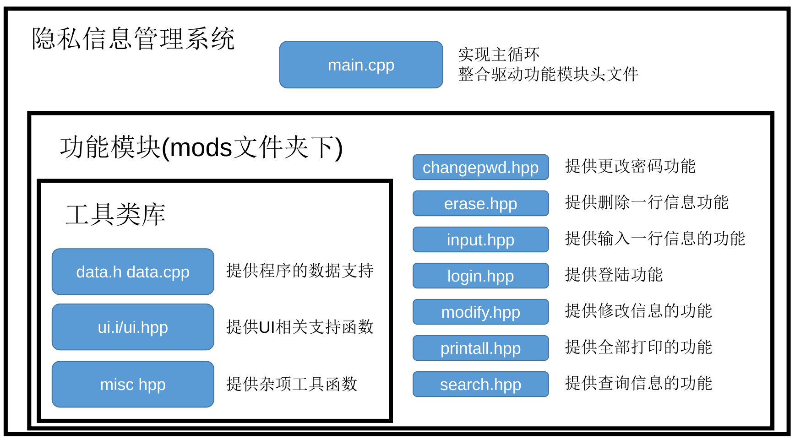

# 任务2-隐私信息管理系统

## 需求分析

用户需要一个软件保存网站上保存的用户名和密码。需要保存的记录如下表所示。

| 编号 | 帐号位置                   | 帐号描述     | 帐号名          | 密码   |
| ---- | -------------------------- | ------------ | --------------- | ------ |
| 1    | https://next.xuetangx.com  | 学堂在线     | xiangdesheng    | 123456 |
| 2    | http://acm.hdu.edu.cn      | 杭电OJ       | acm002          | 654321 |
| 3    | https://www.icourse163.org | 中国大学MOOC | 30047495@qq.com | 123456 |

## 设计目标

系统具体提供以下功能：

- 系统以菜单方式工作。开始运行程序时要进行密码验证。
- 信息的录入功能、浏览功能。
- 信息的查询功能。按帐号名查询，如输入“acm”可查出上表第2条记录。
- 信息的删除、修改功能。
- 信息存入文件。信息中的密码必须要加密后才能存入文件。

除此以外，因选定的编译环境支持多操作系统，所以本项目亦需要支持 `windows`和 `linux`操作系统。

## 总体设计

### 编译环境

本次实验将使用头文件和单头文件技术。使用 `xmake`编译工具，`C++20`标准编译项目。

### 文件模块介绍



## 详细设计

### src/main.cpp

```cpp
#include "cardinal.hpp"
#include "ui.h"
#include "data.h"
#include "mods/allmods.hpp"

const vec<string> main_menu={
    "输入信息",
    "查询信息",
    "查看全部信息",
    "修改信息",
    "删除信息",
    "更改密码",
    "退 出"
};
void(*menu_func[])(void)={
    input,
    search,
    printall,
    modify,
    erase,
    changepwd,
    [](){exit(0);}
};
int main(int argc, char** argv){
    inidb1();//data.h提供，初始化密码
    login();//mod/login.hpp提供
    inidb2();//data.h提供，
    while (true){//主循环
        int w=ui::choose(main_menu,"主菜单");
        menu_func[w]();
        syncdb();
        ui::getline("按回车键返回主菜单",true);
    }
    return 0;
}
```

### data.h/data.cpp简要介绍

- data.h

```cpp
string encrypt(const string& a,const string& key="");//加密
string decrypt(const string& a,const string& key="");//解密
string shash(const string& a);//哈希

string encode(const string& a);//编码（去除换行符）
string decode(const string& a);//解码

inline const map<string,string> default_kv={//默认密码
    {"password",shash("passwd")},
};
struct user{//一行信息
    string pos,description,name,pwd;
    string to_string() const;//序列化
    static user from_string(string str);//反序列化
};
using dbT=map<string,string>;//键值数据库基于std::map
extern dbT data_base;//键值数据库
extern vec<user> user_list;//用户信息列表
void syncdb();//写入数据库到文件

void inidb1();//初始化密码
void inidb2();//登陆成功后获取数据库
```

- data.cpp

加密/解密函数实现使用了模意义上的乘法逆元，加密步骤循环对原串每一位在模数为$65521$的同余系上乘上$a$，以两个字节输出。$a$每次和 `key`迭代加盐哈希。解密则反之。能实现较强的加密，但是会占用两倍的存储空间。

```cpp
string encrypt(const string& a,const string& key){
    using mchar=_mint<uint16_t,uint32_t,65521>;
    auto num=hash<string>()(key);
    string w;
    for (auto i:a){
        mchar c=(uint16_t)(unsigned char)i;
        c*=(mchar)num;
        w+=c.v&(0x00ff);
        w+=(c.v&(0xff00))>>8;
        num=hash<string>()(to_string(num)+"salt"+key);
    }
    return w;
}

string decrypt(const string& a,const string& key){
    using mchar=_mint<uint16_t,uint32_t,65521>;
    auto num=hash<string>()(key);
    string w;
    for (size_t i=0;i<a.size();i+=2){
        mchar c=(uint16_t)(unsigned char)a[i]|
        ((uint16_t)(unsigned char)a[i+1]<<8);
        c/=(mchar)num;
        w+=(char)c.v;
        num=hash<string>()(to_string(num)+"salt"+key);
    }
    return w;
}
```

为了方便哈希直接使用了 `std::hash`。

```cpp
string shash(const string& a){return to_string(hash<string>()(a));}
```

`encode`和 `decode`函数用于转义和反转义。转义的目的是为了去掉回车符。而 `decodep`使用转义后没有单个'\\'字符的特性，将输入字符串根据单个'\\n'字符分割输入字符串。可以用于用户信息序列化字符串的分割和多用户信息的分割。

```cpp
string encode(const string& a){//del \n
    string r;
    for (auto &i:a){
        if (i=='\\'){
            r+="\\\\";
        }else if (i=='\n'){
            r+="\\n";
        }else r+=i;
    }
    return r;
}

string decode(const string& a){//gen \n
    string r;
    for (size_t i=0;i<a.size();i++){
        auto ai=a[i];
        if (ai=='\\'){
            if (i+1<a.size()){
                if (a[i+1]=='n'){
                    i++;
                    r+='\n';
                }else if (a[i+1]=='\\'){
                    i++;
                    r+='\\';
                }
            }
        }else r+=ai;
    }
    return r;
}

vec<string> decodep(const string& a){//gen \n
    vec<string> r;string w;
    for (size_t i=0;i<a.size();i++){
        auto ai=a[i];
        if (ai=='\\'){
            if (i+1<a.size()){
                if (a[i+1]=='n'){
                    i++;
                    w+='\n';
                }else if (a[i+1]=='\\'){
                    i++;
                    w+='\\';
                }else{
                    if (w.size()){
                        r.push_back(move(w));
                        w=string();
                    }
                }
            }
        }else w+=ai;
    }
    if (w.size()) r.push_back(move(w));
    return r;
}
```

单个用户数据的序列化和反序列化，和全部用户数据的序列化和反序列化。

```cpp
#define config_filename (config_dir+"pwdkeeper.cfg")

string user::to_string()const{
    return
    encode(pos)+"\\"+
    encode(description)+"\\"+
    encode(name)+"\\"+
    encode(pwd);
}

user user::from_string(string str){
    user u;
    auto v=decodep(str);
    u.pos=move(v.at(0));
    u.description=move(v.at(1));
    u.name=move(v.at(2));
    u.pwd=move(v.at(3));
    return u;
}

string encode_users(const vec<user>& v){
    string str;
    for (size_t i=0;i<v.size();i++)
        str+=encode(v[i].to_string())+"\\";
    return str;
}

vec<user> decode_users(const string& str){
    vec<user> v;
    auto w=decodep(str);
    for (auto& i:w)
        v.push_back(user::from_string(i));
    return v;
}
```

数据库存入文件时将用户信息列表存入数据库，然后将数据库序列化后加密输出。

```cpp
void syncdb(){
    ofstream os(config_filename,ios::binary);
    string out;
    data_base["users"]=encode_users(user_list);
    for (auto &[k,v]:data_base){
        out+=encode(k)+"="+encode(v)+"\n";
    }
    os<<data_base["password"]<<endl<<
    encrypt(out,decrypt_key);
}
```

数据库的读入分两个步骤，第一步调用 `inidb1`获取到密码的哈希值。之后 `login`模块会根据密码的哈希值计算得到数据库加密密钥 `decrypt_key`。第二步调用 `inidb2`根据 `decrypt_key`解密数据库。

```cpp
void inidb1(){
    data_base=default_kv;
    ifstream is(config_filename,ios::binary);
    string a;
    getline(is,a);
    if (a.size()){
        data_base["password"]=a;
    }else return ;
}
void inidb2(){
    string input;
    {
        ifstream is(config_filename,ios::binary);
        while (is&&is.get()!='\n');
        while (is) input+=is.get();
    }
    auto w=split(decrypt(input,decrypt_key),"\n");
    for (auto& str:w){
        int w=str.find('=');
        if (str.size()&&(0<=w&&w<str.size()))
            data_base[decode(str.substr(0,w))]=decode(str.substr(w+1));
    }
    user_list=decode_users(data_base["users"]);
}

```

### ui.h

所有ui被包含在ui命名空间下，基于UI和数据操作可以分离的思想（即前后端分离）。

```cpp
#pragma once

#include "cardinal.hpp"
namespace ui{

string getline(const string& msg,bool allow_empty=false);//根据提示请求用户输入一行字符串

istream& getline(string &str,const string& msg,bool allow_empty=false);//上一个函数的引用版本

int choose(const vec<string>& v,const string& name="");//在菜单中选择一项

size_t getint(size_t l,size_t r,const string& msg="");//输入[l,r)中的一个整数
}

```

### os.hpp

根据操作系统的不同使用不同路径保存数据库。

```cpp
#ifdef _WIN32
inline const string config_dir=string(getenv("appdata"))+"\\";
#else
inline const string config_dir=string(getenv("HOME"))+"/.config/";
#endif
```

### mods文件夹下功能模块

#### changepwd.hpp

更改密码，为了安全写入到数据库的是密码的哈希值。

```cpp
inline void changepwd(){
    string pwdnew=ui::getline("请输入新密码:"s);
    data_base["password"]=shash(pwdnew);
    update_decrypt_key(pwdnew);
    println("更改密码成功");
}
```

#### earse.hpp

删除一行信息。

```cpp
inline void erase(){
    size_t wi=ui::getint(0,user_list.size(),"请输入将删除的编号");
    auto& u=user_list[wi];
    println("选中) {} {} {} {} {} {}",wi,u.pos,u.description,u.name,u.pwd);
    string str=ui::getline("输入yes（小写）删除");
    if (str=="yes"){
        user_list.erase(user_list.begin()+wi);
        println("删除完毕");
    }else{
        println("用户取消删除");
    }
    syncdb();
}
```

#### input.hpp

添加一个新用户。

```cpp
inline void input(){
    user_list.push_back(user{
        ui::getline("请输入新用户帐号位置"),
        ui::getline("请输入新用户帐号描述"),
        ui::getline("请输入新用户帐号名"),
        ui::getline("请输入新用户密码")
    });
    syncdb();
}
```

#### login.hpp

登陆模块。

```cpp
inline string decrypt_key;
inline void update_decrypt_key(const string& rawpwd){
    decrypt_key=shash(rawpwd+"salt"+shash(rawpwd));//加盐
}
inline void login(){
    while ([](){
        string password;
        ui::getline(password,"请输入密码:"s);
        if (data_base["password"]==shash(password)){
                println("登陆成功");
                update_decrypt_key(password);
                return false;
            }
        println("用户名或密码错误，登陆失败");
        return true;
    }());
}
```

#### modify.hpp

修改一个用户信息的模块。

```cpp
inline void modify(){
    size_t wi=ui::getint(0,user_list.size(),"请输入将修改的编号");
    auto& u=user_list[wi];
    println("选中) {} {} {} {} {} {}",wi,u.pos,u.description,u.name,u.pwd);
    size_t ci=ui::choose({
        "帐号位置","帐号描述","帐号名","密码"
    },"请选中将要修改的值");
    if (ci==0){
        u.pos=ui::getline("请输入新的帐号位置");
    }else if (ci==1){
        u.description=ui::getline("请输入新的帐号描述");
    }else if (ci==2){
        u.name=ui::getline("请输入新的帐号名");
    }else if (ci==3){
        u.pwd=ui::getline("请输入新的密码");
    }
    println("修改完毕，结果为\n) {} {} {} {} {} {}",wi,u.pos,u.description,u.name,u.pwd);
    syncdb();
}
```

#### printall.hpp

输出全部用户信息的模块

```cpp
inline void printall(){
    println("共 {} 条信息",user_list.size());
    println("( {} {} {} {} {}","编号","帐号位置","帐号描述","帐号名","密码");
    for (size_t i=0;i<user_list.size();i++){
        auto& u=user_list[i];
        println("( {} {} {} {} {}",i,u.pos,u.description,u.name,u.pwd);
    }
}
```

#### search.hpp

查询用户信息的模块

```cpp
inline void search(){
    string str=ui::getline("请输入帐号位置");
    vec<pair<int,reference_wrapper<user>>> v;
    for (size_t i=0;i<user_list.size();i++){
        auto &ui=user_list[i];
        if (ui.pos.find(str)!=string::npos)
            v.push_back({i,ref(ui)});
    }
    println("查询 {} ,总共 {} 条信息",str,v.size());
    println(") {} {} {} {} {}","编号","帐号位置","帐号描述","帐号名","密码");
    for (size_t i=0;i<v.size();i++){
        int ii=v[i].first;
        user& u=v[i].second.get();
        println(") {} {} {} {} {} {}",ii,u.pos,u.description,u.name,u.pwd);
    }
}
```

## 遇到的问题和解决办法

根据ODR（One Definition Rule，单一定义原则）。在一个cpp文件中只允许有一个定义，头文件中只能包含声明。而对于单一头文件即既包含声明和实现的hpp文件，需要加入inline指定不同翻译单元(cpp文件)间合并相同的定义。

## 结束语

学习到了现代C++工程构建技术，和玩具级加密解密技术。


