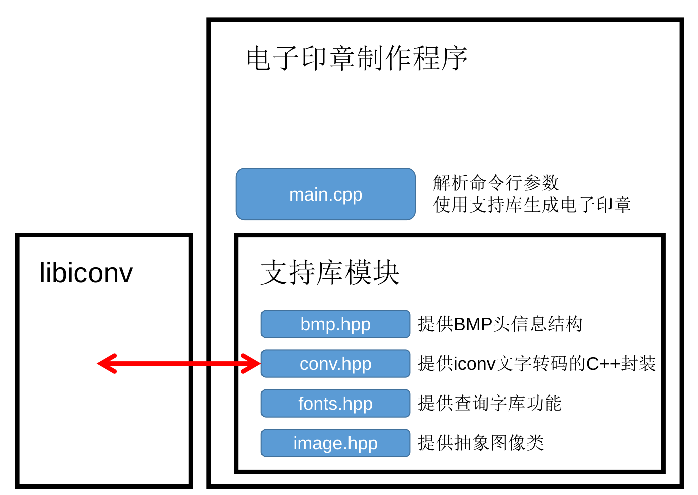

# 任务三-电子印章制作程序

## 需求分析

用户需要制作一个软件输入四字生成以下形状的电子印章。


## 设计目标

程序具体要实现以下功能

- 读取字库
- bmp文件格式的写入

## 总体设计

### 编译环境

本次实验将使用头文件和单头文件技术。使用 `xmake`编译工具，使用来自`GNU project`的`libiconv`项目转码`UTF-8`输入，`C++20`标准编译项目。

### 文件模块介绍



## 详细设计

### bmp.hpp

提供BMP文件头信息结构体，一并给出第一步生成头文件信息结构体的函数。

```cpp
namespace bmp{
    using i32=int32_t;//LONG
    using u32=uint32_t;//DWORD
    using i16=int16_t;//
    using u16=uint16_t;//WORD
    #pragma pack(push,1)
    //取消内存对齐，直接可以dump到文件
    struct BMP_HEADER{
        u16 bfType{0x4D42};
        u32 bfSize;//
        u16 bfReserved1{0};
        u16 bfReserved2{0};
        u32 bfOffBits;
    };
    struct BMP_INFO_HEADER{
        u32 biSize{40};
        i32 biWidth;
        i32 biHeight;
        u16 biPlanes{1};
        u16 biBitCount;
        u32 biCompression{0};
        u32 biSizeImage;
        i32 biXPelsPerMeter{11811},biYPelsPerMeter{11811};
        u32 biClrUsed;//
        u32 biClrImportant{0};
    };
    struct BMP_FILE_HEADER{
        BMP_HEADER h1;
        BMP_INFO_HEADER h2;
    };
    #pragma pack(pop)
    inline BMP_FILE_HEADER make_rgb_header(i32 n,i32 m){
        BMP_FILE_HEADER a;
        tie(a.h2.biHeight,a.h2.biWidth)=make_tuple(n,m);
        a.h1.bfOffBits=sizeof(a.h1)+sizeof(a.h2);
        return a;
    }

}
```

### image.hpp

提供抽象图像信息模板类原型`_bitmap<T>`，并特化为`bitmap`和`rgbmap`。其中`bitmap`将在读取字库的`fonts.hpp`中用到，`rgbmap`则为最终输出BMP文件用到。然后实现`rgbmap`的转`bmp`文件字符串函数。

```cpp
using rgb=array<uint8_t,3>;

template<class T>
struct _bitmap{
    size_t n,m;
    vec<T> c;
    inline _bitmap()=default;
    inline _bitmap(size_t n,size_t m):n(n),m(m){
        c.resize(n*m);
    }
    inline _bitmap(size_t n,size_t m,T a):n(n),m(m){
        c.resize(n*m,a);
    }
    inline decltype(auto) operator()(size_t i,size_t j){//使用函数调用重载实现二维数组访问
        return c[i*m+j];
    }
    inline decltype(auto) operator()(size_t i,size_t j)const{
        return c[i*m+j];
    }
    inline string to_bmp();
};
template<>
inline string _bitmap<rgb>::to_bmp(){//实现将rgbmap转bmp文件数据
    set<rgb> s;
    string str;
    auto h=bmp::make_rgb_header(n,m);
    for (int i=n-1;i>=0;i--)
        for (int j=0;j<m;j++)
            s.insert((*this)(i,j));
    h.h1.bfSize=str.size()+sizeof(h);//补充文件头信息
    h.h2.biClrUsed=s.size();
    h.h2.biSizeImage=0;
    h.h2.biBitCount=24;
    dump_to_string(h,str);//
    for (int i=n-1;i>=0;i--)
        for (int j=0;j<m;j++)
            dump_to_string((*this)(i,j),str);
    return str;
}

using bitmap=_bitmap<bool>;
using rgbmap=_bitmap<rgb>;
```

### fonts.hpp

传入`LiShu56.txt`接受的GB系列中文单字编码，返回点阵文字信息的`bitmap`。

```cpp
#pragma once
#include "cardinal.hpp"
#include "image.hpp"
inline optional<bitmap> find_bitmap(string hexcode){
    string header="CurCode: "+hexcode,cc;
    ifstream is("LiShu56.txt");
    while ((getline(is,cc),is)&&!cc.starts_with(header));
    if (cc.starts_with(header)){
        bitmap b;
        getline(is,cc);
        int cntm=0,cntn=0;
        while ((getline(is,cc),is)&&(cntm=[&](){
            int cnt=0;
            for (auto i:cc){
                if (i=='X')
                    b.c.push_back(1),cnt++;
                if (i=='_')
                    b.c.push_back(0),cnt++;
            }
            return cnt;
        }())){
            b.m=cntm;
            cntn++;
        }
        b.n=cntn;
        return b;
    }
    return {};
}
```

### conv.hpp

简单封装`libiconv`，没处理错误码。

```cpp
#pragma once
#include "cardinal.hpp"
#include "iconv.h"
class conventer{
    iconv_t bg;
    public:
    inline conventer(const string& to,const string& from){
        bg=iconv_open(to.c_str(),from.c_str());
    }
    inline string operator()(const string& str){
        string w;w.resize(str.size());
        size_t wleft=w.size(),sleft=str.size();
        char *wc=const_cast<char*>(w.c_str());
        char* sc=const_cast<char*>(str.c_str());
        iconv(bg,&sc,&sleft,&wc,&wleft);
        w.resize(wc-w.c_str());
        return w;
    }
    inline ~conventer(){
        iconv_close(bg);
    }
};
```

### main.cpp

具体实现代码。

```cpp
string name,filename="out.bmp";
string dump_to_hex(uint8_t c){//将一个unsigned char转成两位十六进制字符串
    auto single_to_hex=[](uint8_t a)->char{
        return a<10?a+'0':(a-10+'a');
    };
    return string()+single_to_hex(c/16)+single_to_hex(c%16);
}

template<class T>
string dump_to_hex(const T& a){//将一个类型成两位十六进制字符串
    string w;
    auto c=reinterpret_cast<uint8_t*>(&a);
    for (size_t i=0;i<sizeof(a);i++)
        w+=dump_to_hex(c[i]);
    return w;
}
string dump_to_hex(void* a,size_t n){//上一个函数的C风格版本
    string w;
    uint8_t* c=(uint8_t*)a;
    for (size_t i=0;i<n;i++)
        w+=dump_to_hex(c[i]);
    return w;
}

void help(){//输出帮助信息
    println("使用: $seal [options] [name]");
    println("options:");
    println("   -o [filename]       输出到filename");
    println("   -h                  打印此帮助信息");
}

void parse(vec<string> args){//简单解析命令行参数
#define byebye(exitcode) {help();exit(exitcode);}
    array<bool,2> ba={};
    if (args.size()==1) byebye(0);
    for (size_t i=1;i<args.size();i++){
        if (args[i]=="-o"){
            if (i+1==args.size()||ba[0]) byebye(-1);
            filename=args[i+1];
            i++;
            ba[0]=1;
        }else if (args[i]=="-h"||args[i]=="--help"){
            byebye(0);
        }else{
            if (ba[1]) byebye(-1);
            name=args[i];
            ba[1]=1;
        }
    }
    return ;
#undef byebye
}

constexpr auto REDW=20;//输出印章红色边缘宽度
constexpr auto WITW=10;//输出印章红色边缘离文字宽度
constexpr auto BLK1W=REDW+WITW;
constexpr auto BLK2W=BLK1W*2;
constexpr auto RED=rgb{0,0,255};//红色的rgb值，rgb结构体的三个分别代表{b,g,r}
constexpr auto WIT=rgb{255,255,255};//白色

int main(int argc, char** argv){
    parse({argv,argv+argc});//解析命令行参数
    string buff;
    buff=conventer("GB18030","UTF-8")(name);//转码为字库的GB码
    string hexbuff[2][2];
    for (size_t i=0;i<8;i+=2)
        hexbuff[0][i>>1]=dump_to_hex(&buff[i],2);//转成十六进制码

    bitmap bmbuff[2][2];int pn=0,pm=0;

    for (int i=0;i<2;i++){
        for (int j=0;j<2;j++){
            auto w=find_bitmap(hexbuff[i][j]);//查表
            if (w){
                pn=w->n;
                pm=w->m;
                bmbuff[i][j]=move(*w);
            }
        }
    }

    for (int i=0;i<2;i++)
        for (int j=0;j<2;j++)
            bmbuff[i][j].c.resize(pn*pm);
    
    swap(bmbuff[0][0],bmbuff[0][1]);
    swap(bmbuff[1][0],bmbuff[1][1]);
    swap(bmbuff[0][0],bmbuff[1][1]);//交换文字顺序使其符合印章顺序
    rgbmap a(pn*2+BLK2W,pm*2+BLK2W,WIT);//建立要输出的图像
    for (int i=0;i<2;i++)//填字
        for (int j=0;j<2;j++){
            int bi=BLK1W+i*pn,bj=BLK1W+j*pm;
            for (int ii=0;ii<pn;ii++)
                for (int jj=0;jj<pm;jj++)
                    a(bi+ii,bj+jj)=bmbuff[i][j](ii,jj)?RED:WIT;
        }
    for (int i=0;i<REDW;i++) for (int j=0;j<a.m;j++) a(i,j)=RED;//外圈涂红
    for (int i=0;i<a.n;i++) for (int j=0;j<REDW;j++) a(i,j)=RED;
    for (int i=0;i<REDW;i++) for (int j=0;j<a.m;j++) a(a.n-i-1,j)=RED;
    for (int i=0;i<a.n;i++) for (int j=0;j<REDW;j++) a(i,a.m-j-1)=RED;
    ofstream(filename,ios::binary)<<a.to_bmp();//转成bmp输出
    return 0;
}
```

### xmake.lua

xmake读取的构建文件，因为使用了`iconv`库所以需要额外链接`iconv`库，即添加`-liconv`编译选项。

```cpp
add_rules("mode.debug", "mode.release")

target("seal")
	set_languages("c++20")
	set_optimize("fastest")
	add_includedirs("../headers")
	add_includedirs("include")
    set_kind("binary")
    add_links("iconv")
    add_files("src/*.cpp")
```

## 遇到的问题与解决方法

在现代（Windows需要开启实验性Unicode支持，Linux需要指定LOCAL为zh_CN.UTF-8）操作系统中终端一般采用$UTF-8$编码，遇到GB系列的编码需要进行转换，使用来自`GNU project`的`iconv`库就能很好的解决这个问题。

## 结束语

学习到了C++工程开发的库链接技术。


